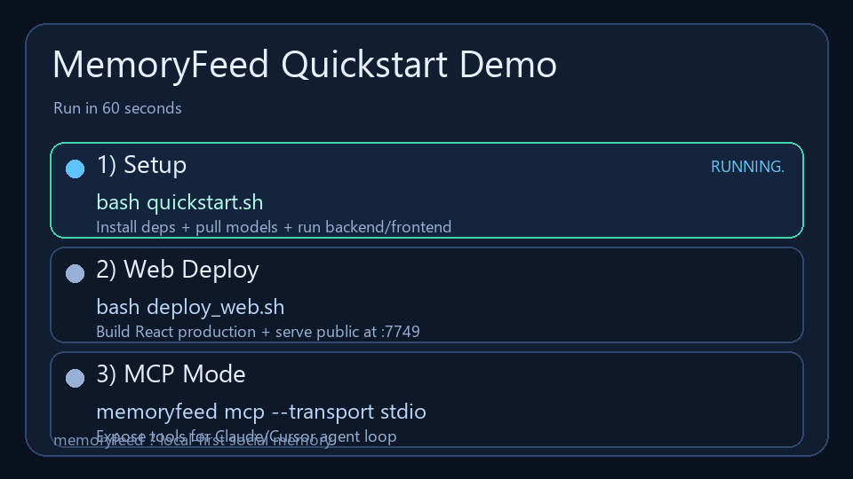

# MemoryFeed


MemoryFeed is a local-first social memory system:

- Browser extension captures social posts after 3s dwell.
- FastAPI backend stores content in SQLite (WAL) + FTS5.
- LanceDB stores semantic vectors for multilingual search.
- Vision pipeline (Ollama `llava:7b`) captions images/memes asynchronously.
- React + Vite + TypeScript frontend is the main operator console.
- Optional C++ native acceleration speeds critical ranking/text ops.
- Item metadata management (star/note/tags), export/import, and queue observability.

No cloud, no API key, no data leaves your machine.

## Architecture

- `extension/chrome`: Chromium extension (Chrome/Edge/Brave).
- `extension/firefox`: Firefox extension package.
- `backend`: capture normalization, store, indexing, search, server.
- `frontend`: React app (Search / Timeline / Stats).
- `native`: pybind11 C++ module (`memoryfeed_native`) for acceleration.

## Web App (React + TypeScript)

Frontend stack:
- React 19
- Vite 8
- TypeScript (strict mode)
- React Query + React Router

Commands:

```bash
cd frontend
npm install
npm run typecheck
npm run build
```

## MCP Flow (Agent Integration)

MemoryFeed includes a local MCP server so Claude/Cursor/other agents can inspect health and query memories directly.

Run MCP over stdio (recommended for local MCP clients):

```bash
memoryfeed mcp --transport stdio
```

Run MCP over streamable HTTP:

```bash
memoryfeed mcp --transport streamable-http --host 127.0.0.1 --port 7748 --path /mcp
```

Available MCP tools:

- `detect_stack`
- `check_project_health`
- `get_memoryfeed_stats`
- `search_memory`
- `timeline_memories`

## Requirements

- Python 3.12+
- Node.js 20+
- Ollama running on `http://localhost:11434`
- Models:
  - `qwen2.5:7b`
  - `llava:7b`

Optional for C++ acceleration:

- Windows: Visual Studio C++ Build Tools
- Linux/macOS: GCC/Clang with C++17

## Quickstart (No Thinking)

### Windows (PowerShell) - one command

```powershell
.\quickstart.ps1
```

### macOS / Linux - one command

```bash
bash quickstart.sh
```

This will:
- install Python package + frontend deps
- check Ollama and pull required models
- start backend (`:7749`) and frontend (`:5173`)
- auto-open browser

## Quickstart 60s

### Local dev console

```bash
bash quickstart.sh
```

or on Windows:

```powershell
.\quickstart.ps1
```

### Public web (for other devices)

```bash
bash deploy_web.sh
```

or on Windows:

```powershell
.\deploy_web.ps1
```

### MCP for Claude/Cursor

```bash
memoryfeed mcp --transport stdio
```

### Quickstart Demo (GIF)



Download/open directly: `docs/assets/quickstart-demo.gif`

## Public Web Deploy (React + Vite)

Use this when you want other devices/people to access your web UI.

### Windows

```powershell
.\deploy_web.ps1
```

### Linux/macOS

```bash
bash deploy_web.sh
```

This flow will:
- install backend deps
- build frontend for production (`frontend/dist`)
- run a public server on `0.0.0.0:7749`
- serve both API and React app from one URL

Open from another device:
- `http://<server-ip>:7749`

Optional custom host/port:

```powershell
.\deploy_web.ps1 -HostIp 0.0.0.0 -Port 8080
```

```bash
HOST=0.0.0.0 PORT=8080 bash deploy_web.sh
```

## Manual Setup

```bash
bash setup.sh
```

Then run services:

```bash
memoryfeed serve
cd frontend && npm run dev
```

Frontend dev URL: `http://localhost:5173`  
Backend API URL: `http://localhost:7749`

## Production Frontend Build

```bash
memoryfeed build-frontend
```

After build, FastAPI serves `frontend/dist` directly on `http://localhost:7749`.

## Optional Native C++ Acceleration

Build module:

```bash
memoryfeed build-native
```

Check status:

- API: `GET /api/native/status`
- CLI: `memoryfeed stats` (includes native status)

If native build fails, project continues with Python fallback.

## Extension Load

### Chrome / Edge / Brave (Chromium)
1. Open extensions page:
- Chrome: `chrome://extensions`
- Edge: `edge://extensions`
- Brave: `brave://extensions`
2. Enable **Developer mode**
3. Click **Load unpacked**
4. Select: `extension/chrome/`

### Firefox
1. Open `about:debugging#/runtime/this-firefox`
2. Click **Load Temporary Add-on...**
3. Choose: `extension/firefox/manifest.json`
4. Keep backend running on `http://localhost:7749`

## API Endpoints

- `POST /capture` and `POST /api/capture`
- `GET /api/search`
- `GET /api/timeline`
- `GET /api/stats`
- `GET /api/native/status`
- `GET /api/queues/status`
- `GET /api/items?limit=&offset=&platform=&starred_only=`
- `PATCH /api/items/{id}` (update `starred`, `note`, `tags`)
- `POST /api/admin/export`
- `POST /api/admin/import`
- `DELETE /api/admin/reset?confirm=RESET`
- `GET /healthz`

## CLI

```bash
memoryfeed serve
memoryfeed search "that angry cat meme last week"
memoryfeed serve-web --host 0.0.0.0 --port 7749
memoryfeed mcp --transport stdio
memoryfeed timeline
memoryfeed stats
memoryfeed items --starred
memoryfeed export
memoryfeed import --file ~/.memoryfeed/exports/memoryfeed-export-YYYY-MM-DD.json
memoryfeed models
memoryfeed build-native
memoryfeed build-frontend
memoryfeed reset
```

## Storage Paths

- `~/.memoryfeed/memoryfeed.db`
- `~/.memoryfeed/lancedb/`
- `~/.memoryfeed/images/`

## Logging

- Log file (default): `~/.memoryfeed/logs/memoryfeed.log`
- Rotating policy: 5 MB per file, 3 backups
- Request logs include method, path, status, request id, and duration

Environment variables:

- `MEMORYFEED_LOG_LEVEL=DEBUG|INFO|WARNING|ERROR`
- `MEMORYFEED_LOG_FORMAT=plain|json`
- `MEMORYFEED_LOG_FILE=/custom/path/memoryfeed.log`

## Notes

- `/capture` is non-blocking: vision + embedding run in background queues.
- Dedupe key = URL + first 100 chars of text.
- If Ollama is down, text capture still works.
- Image captions are skipped gracefully when download/model fails.
